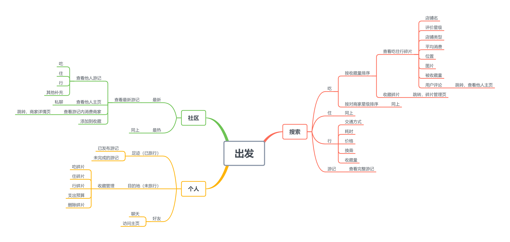
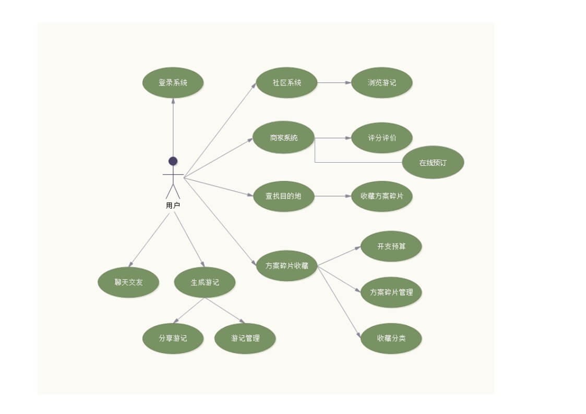
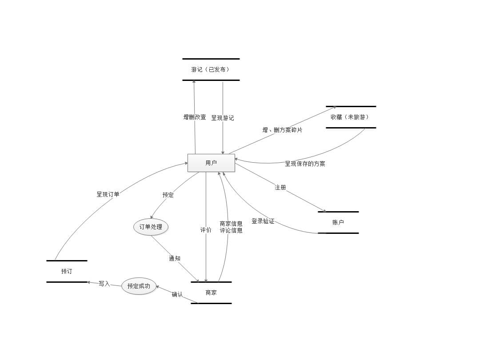

## 出发 GOTOPLAY
> Design & Develop：JUNGA ( xujunjia98@163.com )

> LOGO元素为两只海鸥，寓意着自由，约上好友即刻出门飞向远方。

## 市场分析
- 随着旅游业的发展，目前市场上有众多旅游APP,如马蜂窝、途牛、去哪儿等等。它们具备预定酒店、机票、车票、景点门票等功能，给用户带来诸多便利；
- 大多数的旅游类APP，只有社区讨论分享，攻略分散零碎，内容缺少统一的合理整合(旅游类APP痛点)；
- 随着生活水平日益提高，人们在忙碌的工作之外，也渴望着为生活增添“诗和远方”，提前做好旅行攻略的需求也日益凸显出来，市面上出现了不少针对旅行的APP；
- 2018年第一季度在线旅游市场交易结构方面，据统计数据显示，在线旅游市场交易规模达到233.5亿元，同比增长7.1%。（数据参考文献：《2018年中国在线旅游行业市场数据分析》）由此可见，在线旅游行业目前处于竞争性行业，研究与开发此类APP是市场趋势，也将得到更多需求者的青睐。

## 需求分析
- 用户有旅游需求
- 用户希望APP可以自动生成游记，不用自己记录
- 用户希望可以迅速找到游记攻略中有用的信息
- 对于别人的游记攻略，用户希望可以取其精华去其糟粕，只摘取自己想要的片段，并可以对这些片段进行进一步管理
- 用户希望可以收集目的地的吃住行攻略，在出发前做好准备

## 痛点难点
市面上存在众多的旅游APP，提供了攻略查询和线上预定功能，以及社区分享功能。在这些软件中，用户往往需要自己去记录旅游过程，很多用户便在回忆并记录的门槛前止步，从而可能导致优质的旅游方案无法被发现；在社区查看游记攻略时需要在冗长的文字描述中去找到可用的信息，然后将这些信息搬运到另一处（笔记本、备忘录）进行处理，在这个过程中消耗了多余的时间和精力。  

## 竞争对手&& 竞品分析
马蜂窝、途牛、去哪儿

## 产品简介
“出发”将自动生成游记，帮助用户减少在记录上投入的时间和精力，并支持用户对游记进行进一步编辑。将用户分享游记的内容合理整合，简化寻找有用信息和搬运的操作，帮助旅行者将精力集中在优化方案上，通过收集碎片化的吃住行方案，以及系统根据方案自动给出的预算，渐进式地定制自己的旅游方案。

## 用户群体
主要面向已有出发目的地的用户，为没有目的地的用户设立了社区，帮助他们找到出发的“远方”

## 产品缺点
- 商家信息由用户原创内容提供，可能存在对同一商家，用户提供的地点，商家名不同的情况
- 后台在聚合碎片信息时需要投入巨大精力

## 产品优点
- 系统将根据用户在平台上的“吃住行”消费行为，自动为用户生成当日的游记
- 大多数的旅游类APP，只有社区讨论分享，攻略分散零碎，缺少统一的合理整合。“出发”可以让用户从其他用户的攻略记录中，按个人所需所求找到适合自己的方案片段，形成自己的旅游方案策划链
- 系统将根据形成的方案信息给出开支预算，帮助用户及时调整方案
- 通过算法降低商家刷好评的概率，提高评分可信度，从一定程度上保障消费者消费权益

## 产品版本
### MVP：
- 支持通过搜索目的地检索到对应的攻略碎片信息
- 支持收藏吃住行方案碎片并进行管理
- 支持在线预订，并根据预定的服务生成游记

### v0.8(已完成，但功能仍不完善)
- 搜索：搜索目的地吃住行信息、商家详情查看、商家服务菜单查看
- 预定：在线预定商家服务、查看订单、服务评价
- 游记：（根据订单）自动生成模板游记、游记编辑、游记分享、游记浏览
- 收藏： 收藏游记或搜索结果中的方案碎片、管理碎片、根据收藏的方案碎片进行预算计算
- 社区：浏览最新最热游记

### v1
- 根据目的地聚合所有用户游记攻略中的方案碎片,展示到搜索页中

## 架构图

## 用例图

## 数据流图

## 产品展示视频链接（！！！！！！！！！！）
[出发功能展示](https://www.bilibili.com/video/av54446899)

## 技术栈

### 前端
- Vue.js
- Vue-router
- Vuex
- Axios
- Onsen-UI

### 后端
- Node.js(Express)
- Mongoose

### 数据库
- MongoDB

## 运行
> 本项目为移动端APP，查看效果请运行开发者工具，在手机端调试模式下查看
1. 安装依赖包
   `npm install`

2. 运行开发环境
   `npm run dev 或者 npm start` 

